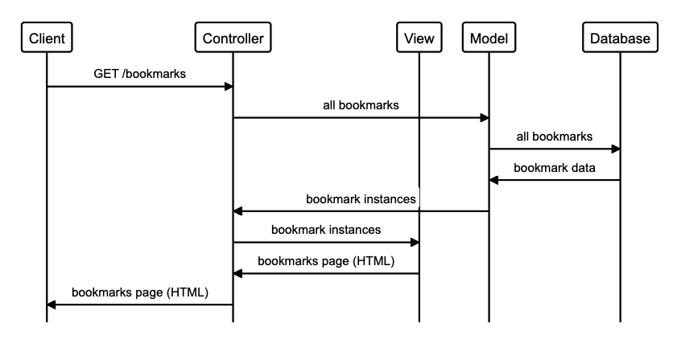

# Bookmark-Manager

    As a user
    so that I can revisit pages I like
    I can see a list of bookmarks

    alias client="Client"
    alias controller="Controller"
    alias view="View"
    alias model="Model"
    alias database="Database"

    client->controller: "GET /bookmarks"
    controller->model: "all bookmarks"
    model->database: "all bookmarks"
    database->model: "bookmark data"
    model->controller: "bookmark instances"
    controller->view: "bookmark instances"
    view->controller: "bookmarks page (HTML)"
    controller->client: "bookmarks page (HTML)"

Connecting to PostgresSQL:
1) Connect to psql
2) Create the database using the psql command CREATE DATABASE bookmark_manager;
3) Connect to the database using the pqsl command \c bookmark_manager;
4) Run the query we have saved in the file 01_create_bookmarks_table.sql